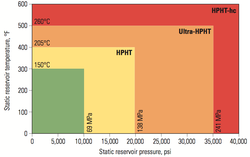

```{r setup, include=FALSE}
knitr::opts_chunk$set(echo = TRUE, warning=FALSE, comment="", fig.align = 'center')
hook_output <- knitr::knit_hooks$get("output")
 
 knitr::knit_hooks$set(output = function(x, options) {
     if (!is.null(n <- options$out.lines)) {
         x <- xfun::split_lines(x)
         if (length(x) > n) {
             # truncate the output
             x <- c(head(x, n), "....\n")
         }
         x <- paste(x, collapse = "\n")
     }
     hook_output(x, options)
 })
```

# Intro 
## Background 
<span style="color:blue">Le cose </span> che *sappiamo* finora sono <font size="3">poche</font>. 

```{r, fig.cap = "Tipo questa.", fig.align='center', out.width="50%", echo=FALSE}
knitr::include_graphics(path = "images/graph.jpeg")
```

## Background

 
## Background

Ma quelle che non sappiamo sono tante tante tante tante 


# Method 
## Participants 
## Stimuli

# Results

